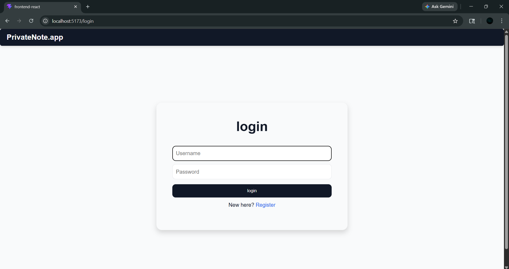
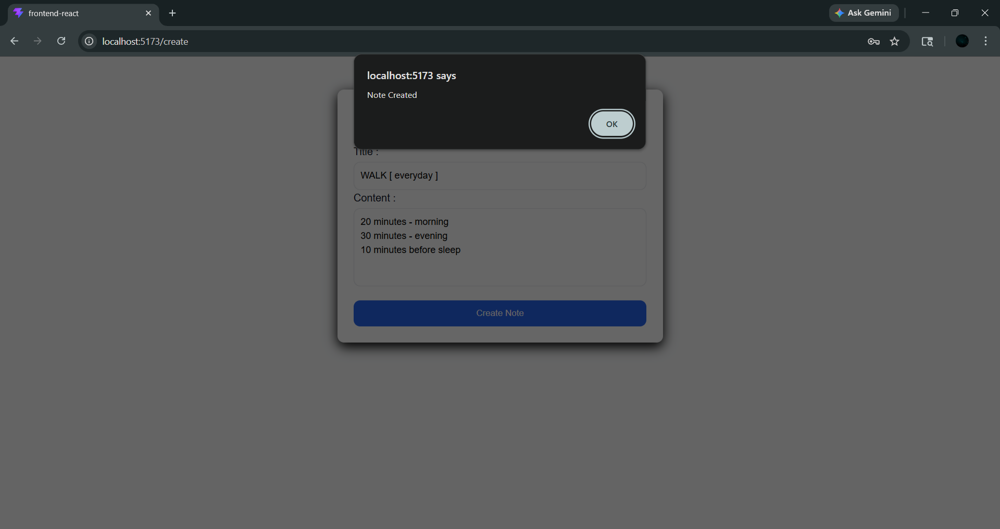
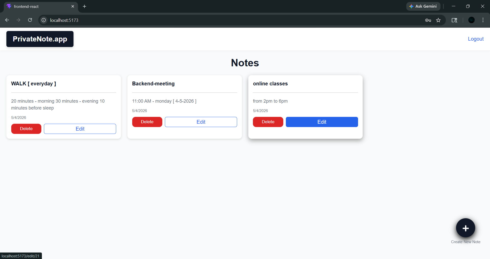
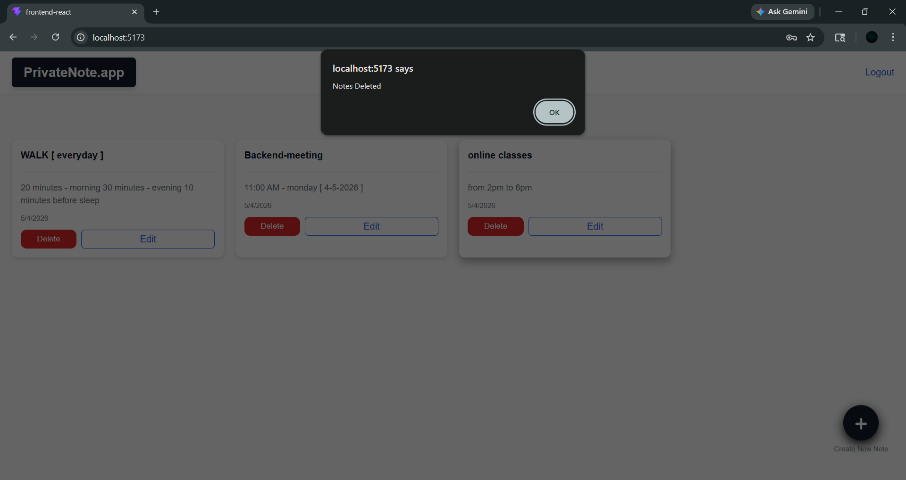

# Note_Book_DRF
build a note book application using Django RESt Framework and React.js

## Description
The application allows users to create, update, read and delete the notes.  
built using Django REST Framework, React.js, PostgreSQL with responsive web design

## Screenshots

